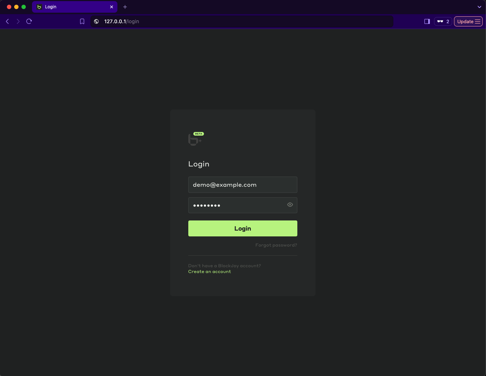

# Blockvisor Stack

## Overview

The Blockvisor stack enables simple configuration, management, and replication of blockchain protocol deployments. It offers several key advantages:

- **Code-defined nodes** ensuring consistent and repeatable deployments
- **Resource isolation** by organizations, users, and nodes
- **Flexible deployment** options including private data centers and bare metal servers

## Architecture

The stack consists of four main components:

### 1. Blockvisor API

Centralized service that manages and provides access to all metadata and information about:
- Protocols
- Running nodes
- Host machines
- Users and organizations

### 2. Blockvisor

A daemon that runs on each host and communicates with the API either directly or through MQTT topics. It enables the management and coordination of nodes in the stack.

### 3. Blockvisor Protocols

Definitions imported into the API that specify:
- Node runtime parameters
- System requirements (memory, CPU, disk, firewall settings)
- Custom protocol configurations
- Additional custom applications that can run alongside protocol clients

### 4. Blockvisor Frontend

User interface for interacting with the API that provides:
- Node management
- Organization setup and user assignment
- Host onboarding information

## Deployment

### Quick Start Guide
#### Requirements
- docker
- docker compose
- git

### Quick Start Deployment
1. Checkout the docs repo
> include all the submodules too
```bash
$ git clone --recursive-submodules https://github.com/blockjoy/blockvisor-docs.git
$ cd blockvisor-docs
```
2. Start the main stack 
> start and build all components
```bash
$ docker compose up --build -d
```

3. Initialize the database with Roles, Users and a dev Region
> This will create an initial admin user and non-admin user with the password you define
```bash
$ docker compose run init
[+] Creating 2/2
 ✔ Container blockvisor-docs-database-1  Running                                                                                                                                                                                                                                                                               0.0s
 ✔ Container blockvisor-docs-api-1       Running                                                                                                                                                                                                                                                                               0.0s
[+] Running 1/1
 ✔ Container blockvisor-docs-database-1  Healthy                                                                                                                                                                                                                                                                               0.5s

Enter your email: demo@example.com
Enter your first name: demo
Enter your last name: admin
Enter your password:

***Initial User Set is Complete***

----------Credentials----------
Admin User: 		demo@example.com
Non-Admin User: 	user@example.com
Both user passwords are set to what you defined.
The Blockvisor stack setup is complete.  You can now access it at http://<server_ip>
```

4. Stack setup is now complete.  Should now be able to login to the UI with the credentials you provided at the IP of your server or localhost.


### Blockvisor API

*Documentation coming soon*

### Blockvisor

Detailed documentation is available in the [blockvisor](blockvisor/README.md) directory.

#### High-Level Deployment Steps
- Download required bvup  and procure a token
- Install dependencies
- Install Apptainer
- Configure network
- Run bvup

## Blockvisor Protocol

Detailed documentation is available in the [blockvisor-protocols](blockvisor-protocols/README.md) directory.

### High-Level Development Steps
- Define protocol metadata in `babel.yaml`
- Define protocol clients
- Define protocol variants
- Publish protocol info to API
- Build and push protocol image to the registry
- Publish image to Blockvisor API


## Blockvisor Frontend

*Documentation coming soon*
